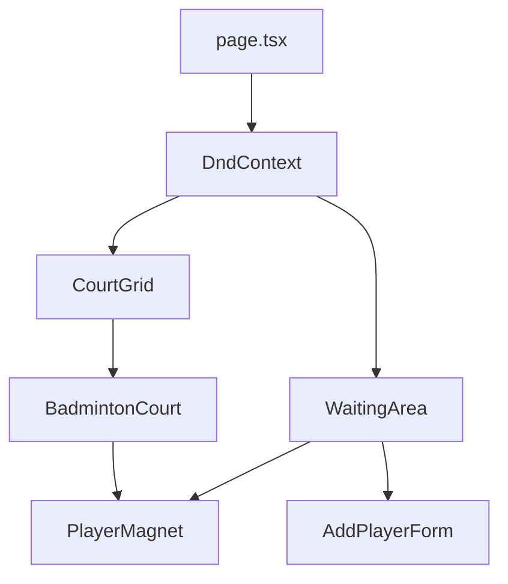

# Architecture 🏗️

랠리보드 프로젝트의 기술적 구조와 설계 의도를 설명합니다.

## 1. 개요 (Overview)
본 프로젝트는 **Next.js 15 (App Router)**를 기반으로 하며, 실시간 점수판 및 대기 명단 관리를 위해 클라이언트 사이드 상태 관리에 집중되어 있습니다. 드래그 앤 드롭(DnD)을 활용한 직관적인 UI/UX를 제공합니다.

## 2. 상태 관리 (State Management)
상태 관리는 **Zustand**를 사용하며, 모든 핵심 로직은 `src/store/useBoardStore.ts`에 집중되어 있습니다.

### 주요 데이터 구조
- `courts`: 코트의 상태(대기/진행중), 진행 시간, 배치된 선수 목록을 관리합니다.
- `waitingList`: 대기 중인 선수들의 목록과 대기 시작 시간을 관리합니다.
- `matchHistory`: 종료된 경기의 기록을 저장합니다.

### 영속성 (Persistence)
- `zustand/middleware`의 `persist`를 사용하여 `LocalStorage`에 데이터를 자동 저장합니다.
- **Hydration 이슈 대응:** 서버와 클라이언트의 데이터 불일치를 방지하기 위해 `page.tsx`에서 `isMounted` 상태를 통해 클라이언트 렌더링을 보장합니다.

## 3. 핵심 기술 (Core Technologies)
- **Drag & Drop:** `@dnd-kit/core` 및 `@dnd-kit/sortable`을 사용합니다.
  - `PlayerMagnet`: 드래그 가능한 플레이어 유닛
  - `BadmintonCourt`: 드롭 가능한 대상
- **Theme System:** `ThemeProvider.tsx`를 통해 'Classic'과 'Retro' 테마를 전환하며, CSS Variables를 활용해 스타일을 제어합니다.

## 4. 컴포넌트 계층 구조 (Component Hierarchy)

## 5. 디자인 원칙 (Design Principles)
- **테일윈드 미사용:** Vanilla CSS Modules를 사용하여 스타일 충돌을 방지하고 각 컴포넌트의 독립성을 유지합니다.
- **레트로 감성:** `nes.css` 라이브러리를 부분적으로 활용하여 8비트 게임 스타일의 감성을 구현했습니다.
